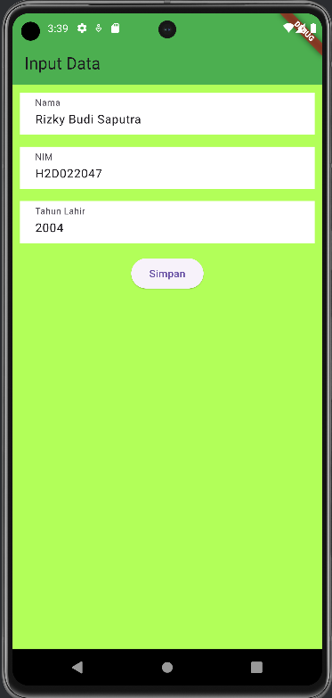
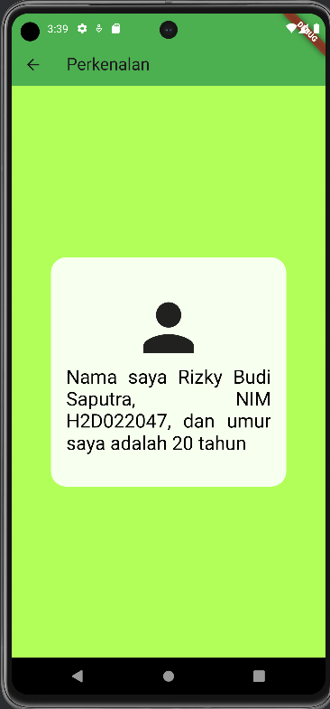

# Tugas Pertemuan 2

Nama : Rizky Budi Saputra

NIM : H1D022047

Shift Baru: F

## Penjelasan

### form_data.dart

Ada 3 input yang dibuat yaitu Nama, NIM, dan Tahun Lahir.

```dart
final _namaController = TextEditingController();
final _nimController = TextEditingController();
final _tahunController = TextEditingController();
```

Masing-masing dibuat sebuah Container untuk menampung dan TextField untuk mengisi. Contohnya :

```dart
_textboxNama() {
    return TextField(
      decoration: const InputDecoration(
        labelText: "Nama",
        border: InputBorder.none,
      ),
      controller: _namaController,
    );
  }
```

Kemudian ada tombol_simpan yang akan mengambil data input dan mengalihkannya ke tampil_data.dart.
```dart
 _tombolSimpan() {
    return ElevatedButton(
        onPressed: () {
          String nama = _namaController.text;
          String nim = _nimController.text;
          int tahun = int.parse(_tahunController.text);
          Navigator.of(context).push(MaterialPageRoute(
              builder: (context) =>
                  TampilData(nama: nama, nim: nim, tahun: tahun)));
        },
        child: const Text('Simpan'));
  }
```
### tampil_data.dart

Pertama dideklarasikan dulu variabelnya dan dibuat supaya dibutuhkan.
```dart
class TampilData extends StatelessWidget {
  final String nama;
  final String nim;
  final int tahun;

  const TampilData({
    Key? key,
    required this.nama,
    required this.nim,
    required this.tahun,
  }) : super(key: key);
```
Umur akan dihitung dari tahun saat ini dikurangi tahun lahir
```dart
final int umur = DateTime.now().year - tahun;
```
Kemudian adalah menampilkan data, dalam string digunakan $ untuk memanggil variabel yang sebelumnya telah dideklarasikan dan didapat dari form_data.dart
```dart
RichText(
    textAlign: TextAlign.justify,
    text: TextSpan(
        text: "Nama saya $nama, NIM $nim, dan umur saya adalah $umur tahun",
        style: const TextStyle(
            fontSize: 25,
            color: Colors.black,
        ),
    ),    
),
```




